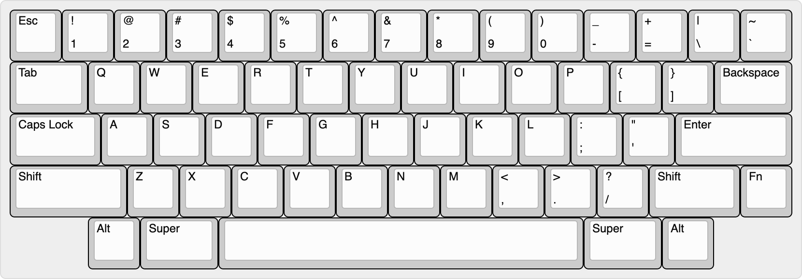

# Daal

### [Discord](https://discord.gg/9DHkFw9t5x)
### [Geekhack](https://geekhack.org/index.php)

Case designed by [Hali](https://github.com/hali4045)\
PCB designed by [Sleepdealer](https://github.com/Sleepdealr/)

| Basic specifications  |            |
| --------------------  | ---------- |
| Typing angle          | 8 Degrees  |
| Adjusted Front height | 18.6mm     |
| Mounting              | Plateless o-ring|
| Case material         | 6063 Aluminum |
| Weight material       | Uncoated brass |

| PCB specifications |         |
| ------------------ | ------- |
| Switch support     | MX only |
| Protection         | ESD + overcurrent |
| MCU                | RP2040 |
| Daughterboard      | Modified XYZ |
| Thickness          | 1.6mm |
| Firmware           | QMK / Vial |

## Layout

## Hardware
|Hardware                 | Specifications    |
| ----------------------- | ----------------- |
| Front Case screws       | [M3 x 0.5mm Thread, 10mm long](https://www.mcmaster.com/91292A113/)|
| Back Case Screws        | [M3 X 0.5mm Thread, 16mm long](https://www.mcmaster.com/91292A115/)|
| Front Weight screws     | [M2.5 x 0.45mm Thread, 4mm long](https://www.mcmaster.com/92125A082/)|
| Broken Weight screws    | [M2.5 x 0.45mm Thread, 8mm long](https://www.mcmaster.com/92125A086/)|
| Daughterboard screws    | [M3 x 0.05mm Thread, 6mm long](https://www.mcmaster.com/92095A179/)|
| Top O-rings             | [75a 1-13/16"ID x 2" OD x 3/32" CS](https://www.theoringstore.com/store/index.php?main_page=product_info&products_id=3255)|
| Bottom O-Rings          | [75a 1-5/6"ID X 1-1/2" OD x 3/32" CS](https://www.theoringstore.com/store/index.php?main_page=product_info&products_id=3279)|
| JST cable               | 75mm |

## License
[CC BY-NC-SA 4.0](https://creativecommons.org/licenses/by-nc-sa/4.0/) by using these files you agree to abide by this license. 
